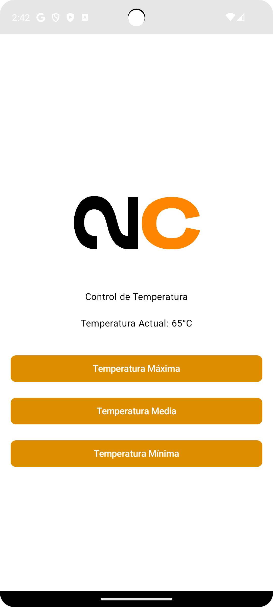

# Nocoiner Control App

# Nocoiner Control App

## Description
**Nocoiner Control App** is an Android application developed to manage **Nocoiner** devices customized by **Natio21**. Nocoiners are unique devices designed to act as heaters while mining Bitcoin, maximizing energy efficiency by repurposing mining heat for practical use.

The app offers an intuitive interface to control the heating output, configure mining pools, and schedule operations.

## Features
- **Heating Control:** Adjust the heating power of the Nocoiner device with a user-friendly interface resembling an electric heater.
- **Timer Functionality:** Set a timer to automatically turn the device on or off at specified times.
- **Pool Configuration:** Manage mining pool settings, including pool URL, username, and password.
- **Auto Discovery:** Automatically scans the local network to detect available Nocoiner devices on startup.
- **Splash Screen:** Displays the **Natio21** logo while the app initializes and discovers devices.

## How It Works
1. Upon launch, the app performs an automatic network scan to discover all available Nocoiner devices.
2. Once devices are detected, users can:
   - Adjust the heat output via a slider or predefined settings.
   - Set timers for scheduled operations (e.g., heat for 2 hours and then turn off).
   - Navigate to the configuration section to input or modify mining pool credentials.
3. All changes are sent to the device in real time via the API.

## Requirements
1. An Android device running Android 8.0 or higher.
2. A local network with Nocoiner devices connected.
3. Mining pool credentials (if customization is required).

## Future Enhancements
- Add iOS support to expand compatibility.
- Include mining monitoring capabilities (e.g., hashrate, temperature, energy consumption).
- Enable remote control over the internet for off-network management.
- Integrate with smart home platforms like Home Assistant for advanced automation.

## Getting Started
1. **Install the App:** Download the APK and install it on your Android device.
2. **Connect to Network:** Ensure your Android device and Nocoiner are on the same local network.
3. **Launch and Discover Devices:** Open the app to detect Nocoiner devices automatically.
4. **Configure Pools:** Navigate to the settings menu to set up mining pool details.
5. **Start Heating:** Use the control interface to adjust the heat or schedule operations.

## Contribution
This project is developed and maintained by **Alejandro Cordón** in collaboration with **Natio21**. Contributions and feedback are welcome to enhance its functionality further.
